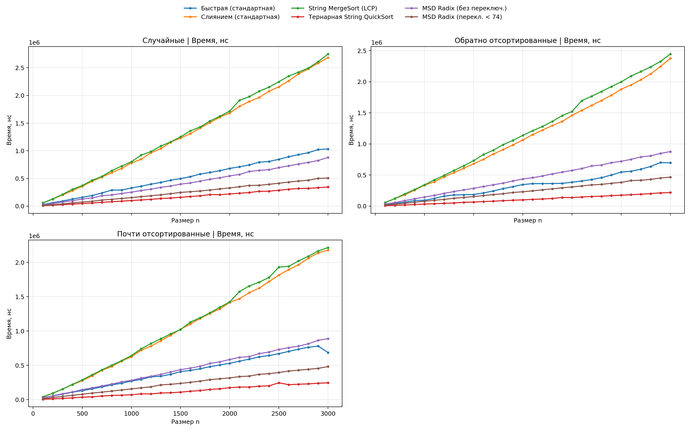
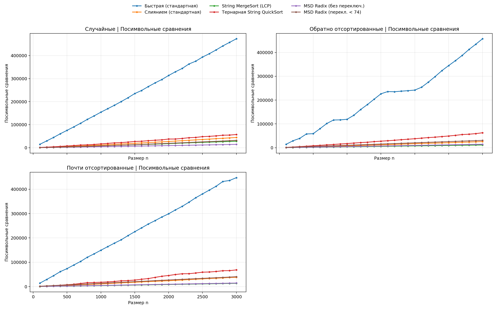

## A1

сравнение стандартных и специализированных алгоритмов сортировки строк в лексикографическом порядке.

## посылки CF
A1m - 375873084   
A1q - 375874307   
A1r - 375876081   
A1rq - 37593114   

##  Реализовано

генерация тестов: случайные, обратно отсортированные, почти отсортированные   
размеры: от `100` до `3000`, шаг `100`   
многократные прогоны `runs = 10`   
метрики: `time_ns` — время выполнения (нс), `char_cmp` — посимвольная работ 

алгоритмы:

1. `quick sort` (стандартный QuickSort)
2. `merge sort` (стандартный MergeSort)
3. `merge sort lcp` (String MergeSort с LCP)
4. `string quick sort3` (тернарный String QuickSort)
5. `msd radix sort` (MSD Radix Sort без переключения)
6. `msd radix sort switch` (MSD Radix Sort с переключением на Quick)
## Файлы

`research.cpp` — `StringGenerator` + `StringSortTester`, запуск эксперимента
`plot_results.py` — агрегация и построение графиков   

## Графики

`plots/time.png`
`plots/cmp.png`
`plots/random_time.png`.  
 `plots/random_cmp.png`.  
 `plots/reverse_time.png`.  
   `plots/reverse_cmp.png`.    
 `plots/almost_time.png`.  
 `plots/almost_cmp.png`.   

## Результаты 

на наборах до 3000 строк быстрее всех сработал string quick sort3, на случайных данных он занял примерно 347 000 нс, на обратно отсортированных около 217 000 нс, на почти отсортированных около 246 000 нс.  
если сравнивать со стандартными алгоритмами, то string quick sort3 получился примерно в 3 раза быстрее quick sort и примерно в 8–11 раз быстрее merge sort.  
  по метрике char_cmp, то есть по посимвольной работе, на random лучший результат у msd radix sort, а на reverse и almost - у merge sort lcp      
алгоритм merge sort lcp обычно проверяет меньше символов, чем merge sort, но по времени не всегда выигрывает, потому что у него есть дополнительная работа с LCP.   
для msd radix sort и msd radix sort switch char_cmp  это не обычные сравнения строк, а чтение символов при раскладке строк по корзинам. 

## Вывод по задаче

если нужна максимальная скорость на этих тестах, лучше всего подходит string quick sort3  

если важно уменьшить количество посимвольной работы лучше merge sort lcp и MSD-подходы   
поэтому нельзя однозначно сказать, что один алгоритм лучший: выбор зависит от того, что важнее время работы или количество обработанных символов  

с точки зрения теории это ожидаемый результат. обычные сортировки на сравнениях имеют сложность O(n log n), но при сортировке строк каждое сравнение может требовать проверки нескольких символов  

алгоритм merge sort lcp уменьшает повторные проверки общих префиксов, поэтому часто снижает количество посимвольной работы  

MSD сортировки работают иначе: они не сравнивают строки попарно, а распределяют их по группам по текущему символу,поэтом для msd radix sort и msd radix sort switch метрика char_cmp в этом исследовании показывает количество чтений символов, а не обычное число сравнений строк  
